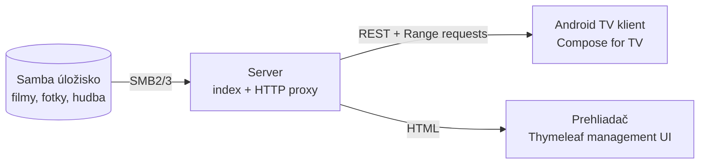
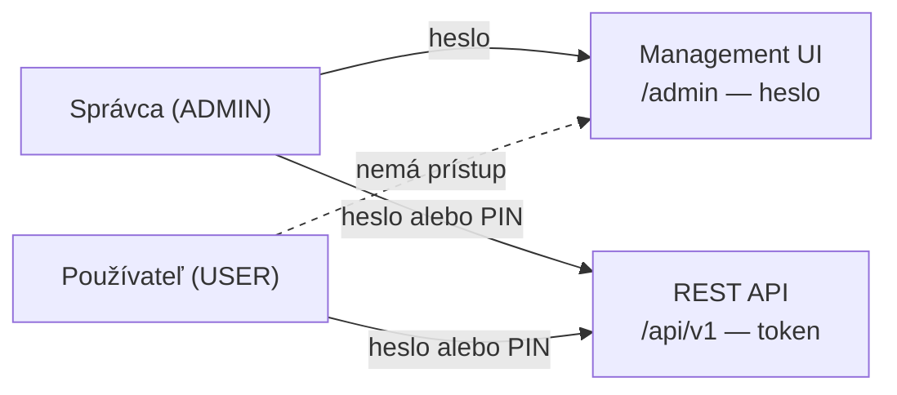
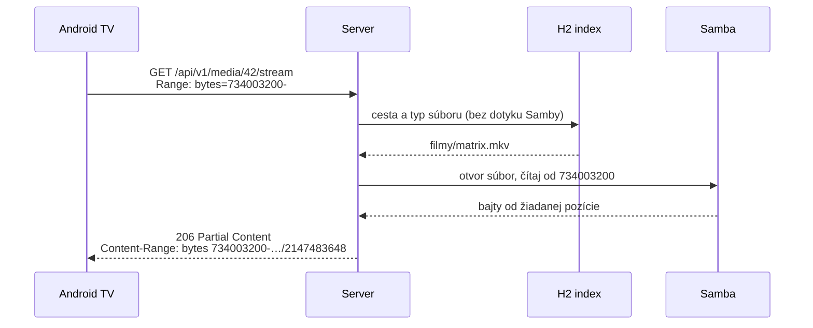

# Domáce mediacentrum

Serverová aplikácia, ktorá sprístupňuje médiá zo Samba úložiska, a natívny klient
pre Android TV. Do budúcna je server navrhnutý tak, aby sa rozšíril o funkcie
smart asistenta pre domácnosť.

**Stav:** server má funkčný základ — indexuje Sambu, dopĺňa filmové metadáta,
streamuje s podporou pretáčania a má webové management UI. Android TV klient sa
ešte nezačal.

## Ako to funguje



Server je jediný, kto pozná prihlasovacie údaje k Sambe. Médiá indexuje do lokálnej
databázy a klientovi ich preposiela cez HTTP s podporou Range requestov, takže
funguje pretáčanie bez sťahovania celého súboru.

Médiá sú rozdelené na tri kategórie: **videá**, **fotky** a **hudba**.

**Zdrojov môže byť nastavených viac** — napríklad filmový NAS a samostatný archív fotiek.
Každá položka indexu si pamätá, odkiaľ pochádza. Sken ich prechádza za sebou a každý
dostane vlastný záznam v histórii; keď je jeden NAS vypnutý, ostatné sa preindexujú
normálne.

### Kto sa kam dostane

Server má účty s dvomi rolami a dva oddelené spôsoby prihlásenia:



**Heslá aj PINy sú hashované Argon2id.** Do management UI treba vždy plné heslo —
PIN je pohodlie pre diaľkový ovládač a otvára výhradne televízor.

Android klient sa prihlási raz a dostane **token**, ktorý si uloží; heslo ani PIN na
zariadení neostávajú. Zmena hesla, zmena PINu aj vypnutie účtu všetky televízory
odhlásia.

### Prečo sa dá pretáčať

Klient nesťahuje celý film. Pýta si rozsah bajtov a server ho zo Samby prečíta
priamo z tej pozície:



Bez `Range` odpovie server 200 a celým súborom, pri rozsahu mimo súboru 416.

## Technologický stack

**Server** — Java 25 (LTS), Spring Boot 4.1, smbj pre SMB prístup, H2 ako
index (schéma cez Flyway), Lombok a voliteľné TMDb API pre filmové metadáta.

**Management UI** — Thymeleaf + Bootstrap 5 + jQuery, video cez Video.js, grafy cez Chart.js
(pridá sa až keď bude treba). Servírované lokálne cez WebJars, nie z CDN.

**Klient** — Kotlin, Jetpack Compose for TV, Media3/ExoPlayer, Retrofit.

Úplný zoznam knižníc aj odôvodnenie výberu je v
[doc/rozhodnutia.md](doc/rozhodnutia.md).

## Ako to spustiť

Treba **JDK 25**.

```powershell
$env:JAVA_HOME = "d:\java\jdk-25"
# Voliteľné: TMDb API Read Access Token pre popisy, žánre a plagáty.
$env:TMDB_READ_ACCESS_TOKEN = "sem-vloz-token"
cd backend
mvn spring-boot:run
```

Potom otvor <http://localhost:8085/admin>. Pri prvom spustení si server založí
správcu **`admin` / `admin`** a hneď si vypýta zmenu hesla — kým ju neurobíš,
nikam inam ťa nepustí. Na stránke **Samba zdroje** potom pridaj úložisko
(adresa, share, prihlasovacie údaje) a spusti sken. Zdrojov môžeš pridať viac.
Index sa uloží do `backend/data/homecenter.mv.db`.

`TMDB_READ_ACCESS_TOKEN` sa získava po registrácii API prístupu v
[nastaveniach TMDb](https://www.themoviedb.org/settings/api). Nie je povinný:
bez neho sken naďalej rozpozná a zoradí seriálové epizódy podľa názvu súboru,
iba nestiahne popisy, hodnotenie, žánre a plagáty. Token sa neukladá do databázy.

### Filmové metadáta a radenie

Pri skene sa videá obohatia zo služby TMDb a výsledok sa uloží do lokálneho H2
indexu. Plagáty sa ukladajú do `backend/data/posters`, takže otvorenie knižnice
už verejné API nevolá. Žánre (napríklad Komédia alebo Horor) sú samostatný filter
vo videoknižnici; nemenia tri hlavné kategórie Videá / Fotky / Hudba.

Automatické rozpoznanie je najspoľahlivejšie pri zaužívaných názvoch:

- film: `The Matrix (1999).mkv`,
- epizóda: `Dark.S01E02.mkv` alebo `Dark.1x02.mkv`,
- viacdielny film: `Dune Part 2 (2024).mkv`.

Epizódy rovnakého seriálu dostanú spoločnú skupinu a radia sa podľa série a čísla
epizódy, nie abecedne (`S01E02` pred `S01E10`). To isté platí pre očíslované časti.
TMDb obohatenie je best-effort: výpadok internetu alebo nenájdený titul nikdy
nezastaví samotný SMB sken.

### Rozhranie

| Adresa | Čo je tam |
|---|---|
| `/admin` | prehľad — počty médií, stav zdrojov, história skenov |
| `/admin/zdroje` | Samba zdroje (jediné miesto, kde sa zadáva heslo k úložisku) |
| `/admin/kniznica` | knižnica s plagátmi, popismi, žánrovým filtrom a náhľadom médií |
| `/admin/pouzivatelia` | účty, roly a PINy |
| `/api/swagger-ui.html` | REST API pre TV klienta (vyžaduje prihlásenie správcu) |
| `/api/openapi` | OpenAPI spec — zmluva medzi serverom a klientom |

Kľúčové API endpointy: `POST /api/v1/auth/login` (vráti token),
`GET /api/v1/library` (tri dlaždice), `GET /api/v1/media?category=video`,
`GET /api/v1/media/{id}/stream` (Range requesty),
`GET /api/v1/media/{id}/poster`, `GET /api/v1/genres` a `POST /api/v1/scan`.

Okrem prihlásenia vyžaduje všetko hlavičku `Authorization: Bearer <token>`:

```bash
TOKEN=$(curl -s -X POST http://localhost:8085/api/v1/auth/login \
  -H "Content-Type: application/json" \
  -d '{"username":"jano","secret":"4321","deviceName":"Obývačka"}' \
  | jq -r .token)

curl http://localhost:8085/api/v1/library -H "Authorization: Bearer $TOKEN"
```

## Štruktúra repozitára

```
backend/    Spring Boot server — REST API, Thymeleaf UI, SMB a indexácia
frontend/   Android TV aplikácia (Kotlin) — zatiaľ prázdne
doc/        zadanie a technologické rozhodnutia
```

Poznámka: Thymeleaf management UI je súčasťou **backendu**
(`src/main/resources/templates`), nie priečinka `frontend/`. Ten je vyhradený
pre Android TV klienta.

## Kľúčové zásady

1. SMB credentials pozná len server, klient nesiaha na úložisko priamo.
2. Samba sa neskenuje pri každom requeste — REST API číta z indexu, sken beží
   na pozadí a dá sa spustiť manuálne.
3. Žiadne transkódovanie, kým to konkrétny súbor nevynúti. Server súbory
   preposiela (direct play).
4. Konfigurácia patrí do Thymeleaf UI v prehliadači, nie na diaľkový ovládač.
   Na TV ostávajú tri dlaždice: Videá / Fotky / Hudba.
5. Kontrakt medzi serverom a klientom drží OpenAPI spec — jazyky sú rôzne,
   modely sa nezdieľajú.
6. Prihlasovanie má dva oddelené režimy: session s CSRF pre prehliadač,
   bezstavový token pre televízor. Miešať sa nesmú.

## Čo ešte nie je hotové

- **Android TV klient** — priečinok `frontend/` je zatiaľ prázdny.
- **Technické metadáta súborov a náhľady fotiek** — dĺžka, kodeky a rozmery cez
  ffprobe ani samostatné thumbnaily fotiek zatiaľ nie sú. Filmové popisy, žánre
  a plagáty z TMDb už server indexuje.
- **Server beží na HTTP.** V domácej sieti idú tokeny aj heslá nešifrovane;
  pred vystavením mimo LAN treba HTTPS.
- **Heslo k Sambe je v databáze v otvorenom tvare.** Účty sú hashované, tento
  jeden stĺpec nie — server ho potrebuje poslať Sambe.
- **Prihlasovanie nemá obmedzenie počtu pokusov.** Pri 4-číslicovom PINe to stojí
  za doriešenie.

## Dokumentácia

- [doc/zadanie.md](doc/zadanie.md) — pôvodné zadanie a požiadavky
- [doc/rozhodnutia.md](doc/rozhodnutia.md) — technologické rozhodnutia
  s odôvodnením a zamietnutými alternatívami
