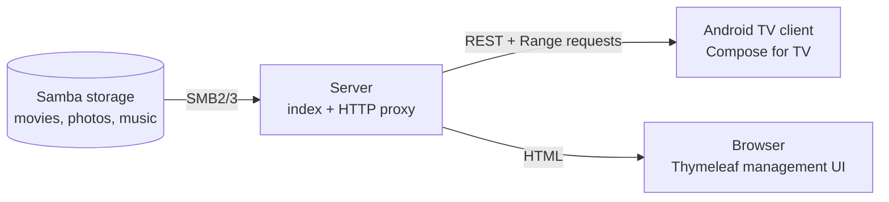
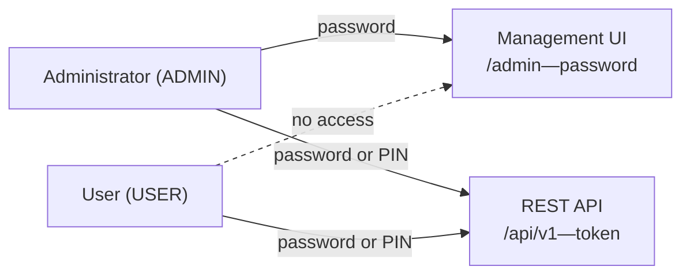
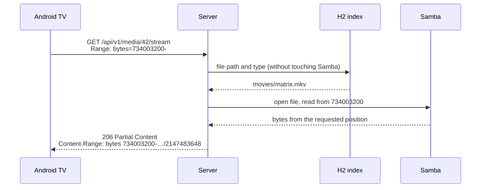

# Home Media Center

A server application that makes media from Samba storage available to a native
Android TV client. The server is designed to support smart home assistant
features in the future.

**Status:** the server has a functional foundation—it indexes Samba, enriches
movies with metadata, supports seekable streaming, and provides a web-based
management UI. The Android TV client exists and builds: server setup, login,
the three tiles, browsing with posters, a detail screen with episodes, and
playback of video, photos and music. It has not yet been run on a real device.

## How it works



The server is the only component that knows the Samba credentials. It indexes
media in a local database and forwards it to the client over HTTP with Range
request support, enabling seeking without downloading the entire file.

Media is divided into three categories: **videos**, **photos**, and **music**.

**Multiple sources can be configured**—for example, a movie NAS and a separate
photo archive. Each indexed item remembers its source. A scan processes the
sources sequentially, giving each one its own history record; if one NAS is
offline, the others are still reindexed normally.

### Who can access what

The server has accounts with two roles and two separate authentication methods:



**Passwords and PINs are hashed with Argon2id.** The management UI always requires
the full password—the PIN is a convenience for remote controls and unlocks only
the TV.

The Android client logs in once and receives a **token**, which it stores locally;
neither the password nor the PIN remains on the device. Changing the password or
PIN, or disabling the account, logs out every TV.

### Why seeking works

The client does not download the whole movie. It requests a byte range, and the
server reads it directly from that position on Samba:



Without `Range`, the server responds with 200 and the entire file; a range outside
the file produces 416.

## Technology stack

**Server**—Java 25 (LTS), Spring Boot 4.1, smbj for SMB access, H2 as the index
(schema managed by Flyway), Lombok, and movie metadata from TMDb or, without a
token, from Cinemeta.

**Management UI**—Thymeleaf + Bootstrap 5 + jQuery, Video.js for browser video,
and Chart.js for charts (to be added only when needed). Everything is served
locally through WebJars, not from a CDN. On top of Bootstrap sits the project's
own design token layer—one colour scale, a light and a dark theme, and an icon
set built from CSS masks; see [doc/design-system.md](doc/design-system.md).

**Client**—Kotlin, Jetpack Compose for TV, Media3/ExoPlayer, Retrofit, Hilt, Room
and Coil. Its REST layer is **generated from the OpenAPI specification**, not
written by hand.

The complete library list and rationale are in
[doc/implementation-plan.md](doc/implementation-plan.md).

## How to run it

**JDK 25** is required.

```powershell
$env:JAVA_HOME = "d:\java\jdk-25"
# Optional: TMDb API Read Access Token for descriptions, genres, and posters.
# Without it, the token-free Cinemeta catalogue is used instead.
$env:TMDB_READ_ACCESS_TOKEN = "insert-token-here"
cd backend
mvn spring-boot:run
```

Then open <http://localhost:8085/admin>. On its first launch, the server creates
the **`admin` / `admin`** administrator account and immediately requires a password
change—you cannot access anything else until you change it. Next, open **Samba
sources**, add storage (address, share, and credentials), and start a scan. You can
add multiple sources. The index is stored in `backend/data/homecenter.mv.db`.

Obtain `TMDB_READ_ACCESS_TOKEN` after registering for API access in the
[TMDb settings](https://www.themoviedb.org/settings/api). It is optional: **without
a token, the server falls back to the public Cinemeta catalogue**, which needs no
account. Cinemeta only provides English texts and does not know movie collections,
which is why TMDb takes precedence whenever a token is present. Setting
`homecenter.metadata.cinemeta-fallback: false` switches enrichment off entirely; a
scan then still recognizes and sorts TV episodes by filename, but downloads no
descriptions, ratings, genres, or posters. The token is not stored in the database.

### Movie metadata and sorting

During a scan, videos are enriched through the active provider, and the result is
stored in the local H2 index. Posters are saved in `backend/data/posters`, so
opening the library does not call the public API. Genres (such as Comedy or Horror)
are a separate filter in the video library; they do not change the three main
categories of Videos / Photos / Music.

Automatic recognition is most reliable with conventional filenames:

- movie: `The Matrix (1999).mkv`,
- episode: `Dark.S01E02.mkv` or `Dark.1x02.mkv`,
- multipart movie: `Dune Part 2 (2024).mkv`.

Episodes of the same series share a group and are sorted by season and episode
number rather than alphabetically (`S01E02` before `S01E10`). The same applies to
numbered parts. Enrichment is best-effort: an internet outage or a missing title
never stops the SMB scan itself.

### Interfaces

| Address | Contents |
|---|---|
| `/admin` | overview—media counts, source status, scan history |
| `/admin/zdroje` | Samba sources (the only place where storage credentials are entered) |
| `/admin/kniznica` | library with posters, descriptions, genre filtering, and media previews |
| `/admin/pouzivatelia` | accounts, roles, and PINs |
| `/api/swagger-ui.html` | REST API for the TV client (requires administrator login) |
| `/api/openapi` | OpenAPI specification—the contract between server and client |

Key API endpoints: `POST /api/v1/auth/login` (returns a token),
`GET /api/v1/library` (the three tiles), `GET /api/v1/media?category=video`,
`GET /api/v1/media/{id}/stream` (Range requests),
`GET /api/v1/media/{id}/poster`, `GET /api/v1/genres`, and `POST /api/v1/scan`.

Except for login, every endpoint requires the `Authorization: Bearer <token>`
header:

```bash
TOKEN=$(curl -s -X POST http://localhost:8085/api/v1/auth/login \
  -H "Content-Type: application/json" \
  -d '{"username":"john","secret":"4321","deviceName":"Living Room"}' \
  | jq -r .token)

curl http://localhost:8085/api/v1/library -H "Authorization: Bearer $TOKEN"
```

### The Android TV client

The client lives in `frontend/` and is a separate Gradle build. **AGP does not run
on JDK 25**, so it needs **JDK 21**—the server's JDK cannot be reused:

```powershell
$env:JAVA_HOME = "d:\java\openlogic-openjdk-21.0.6+7-windows-x64"
cd frontend
.\gradlew.bat assembleDebug        # builds app/build/outputs/apk/debug/app-debug.apk
.\gradlew.bat testDebugUnitTest    # unit tests
.\gradlew.bat lintDebug            # lint
```

`frontend/local.properties` points Gradle at the Android SDK (`sdk.dir`) and is not
committed. Install the result with `adb install -r app-debug.apk`.

The REST layer is **generated during the build** from
`frontend/openapi/homecenter-openapi.json`—a committed export of `/api/openapi`.
No DTO is written twice. After changing the REST API, re-export the snapshot
against a running server:

```powershell
cd frontend\openapi
.\refresh.ps1 -BaseUrl http://localhost:8085 -Username admin
```

On first launch the TV asks for the server address (for example
`http://192.168.1.10:8085`), then for a username and a password or PIN. The client
stores only three things: that address, the returned token, and the position where
each video was left off. Everything else—sources, users, scans—stays in the browser
UI, by design.

## Repository structure

```
backend/    Spring Boot server—REST API, Thymeleaf UI, SMB, and indexing
frontend/   Android TV application (Kotlin)—Compose for TV, Media3, generated REST layer
doc/        assignment and technology decisions
```

Note: the Thymeleaf management UI is part of the **backend**
(`src/main/resources/templates`), not the `frontend/` directory. That directory is
reserved for the Android TV client.

## Key principles

1. Only the server knows the SMB credentials; the client does not access storage
   directly.
2. Samba is not scanned on every request—the REST API reads from the index, while
   scanning runs in the background and can also be triggered manually.
3. No transcoding until a specific file requires it. The server forwards files
   directly (direct play).
4. Configuration belongs in the browser-based Thymeleaf UI, not on a remote
   control. The TV retains three tiles: Videos / Photos / Music.
5. The OpenAPI specification defines the contract between server and client—the
   languages differ, and models are not shared.
6. Authentication has two separate modes: a CSRF-protected browser session and a
   stateless token for the TV. They must not be mixed.

## What is not finished yet

- **The Android TV client has never been run.** It builds, its unit tests pass and
  it lints clean, but no Android TV system image is available on the development
  machine, so the login round trip, poster loading, seeking and D-pad focus order
  are unproven.
- **Technical file metadata and photo thumbnails**—duration, codecs, and dimensions
  through ffprobe, as well as separate photo thumbnails, have not been implemented.
  The server already indexes movie descriptions, genres, and posters.
- **The server runs over HTTP.** Tokens and passwords travel unencrypted on the home
  network; HTTPS is required before exposing the server outside the LAN.
- **The Samba password is stored in plaintext in the database.** Account passwords
  are hashed, but this one column is not—the server needs to send it to Samba.
- **Login attempts are not rate-limited.** This is worth addressing for a four-digit
  PIN.

## Documentation

- [doc/assignment.md](doc/assignment.md)—original assignment and requirements
- [doc/implementation-plan.md](doc/implementation-plan.md)—technology decisions,
  their rationale, and rejected alternatives
- [doc/design-system.md](doc/design-system.md)—colour scale, themes, and the UI
  conventions built on them
