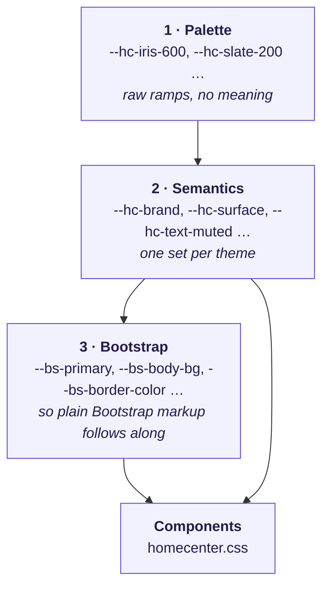

# Design system

The visual foundation of the management UI. It defines the colour scale, shape,
elevation and motion, and the rules for using them. `backend/src/main/resources/static/css/tokens.css`
is the implementation of this document — when the two disagree, the CSS is what
ships, so update both together.

The Android TV client is not bound by this document. It renders with Compose for
TV, at three metres' distance, on a display whose gamma has nothing to do with a
monitor. The palette below is a good starting point for it, but TV contrast and
focus rules are a separate exercise.

## Why a token layer at all

Bootstrap 5.3 already exposes its own theme as CSS custom properties, so the
temptation is to override `--bs-primary` and stop. That falls apart the moment a
second theme appears: `--bs-primary` says *what Bootstrap paints with*, never
*what the colour means here*, and there is nowhere to record that a running scan
and a playing stream are the same idea.

So there are three layers, each allowed to depend only on the one above it.



Two rules follow from the diagram, and they are the whole point of it:

1. **Component CSS never names a palette step.** `var(--hc-iris-600)` in a
   component is a bug, because the dark theme has no chance to redefine it.
   Components use layer 2 only.
2. **A colour that is not in layer 2 does not exist.** If a component needs
   something the semantic layer cannot express, the missing piece is a token, not
   a hex literal in the rule.

## 1 · The palette

Four ramps. Iris carries the brand, Aqua marks activity, Slate builds every
surface, and three status ramps report outcomes.

### Iris — brand

Primary buttons, links, active navigation, focus rings. Chosen as an indigo
violet rather than Bootstrap's default blue: it is far enough from the status
colours that a primary button is never mistaken for a confirmation, and it suits
a media application better than a corporate blue.

| Step | Hex | Used for |
|---|---|---|
| 50 | `#f1f2fe` | light-theme tinted backgrounds |
| 100 | `#e4e6fd` | |
| 200 | `#cdd0fa` | subtle borders on tinted surfaces |
| 300 | `#adaef6` | **dark-theme link and brand text** |
| 400 | `#8b87ef` | brand-mark gradient, player progress |
| 500 | `#7264e6` | dark-theme hover |
| 600 | `#6149d9` | **light-theme brand: buttons, links, focus** |
| 700 | `#5239bd` | light-theme link text and hover |
| 800 | `#442f99` | shell gradient |
| 900 | `#3a2c79` | |
| 950 | `#241b4c` | shell gradient, login backdrop |

### Aqua — activity

Anything live: a running stream, playback, the highlight on the Photos tile. It
is also mapped to `info`. Deliberately *not* used for success — a finished scan
and a running scan must not look alike.

| Step | Hex | | Step | Hex |
|---|---|---|---|---|
| 50 | `#e8fbfa` | | 500 | `#159a9c` |
| 100 | `#c9f4f2` | | 600 | `#0f7b7f` |
| 200 | `#97e8e6` | | 700 | `#116266` |
| 300 | `#5cd4d3` | | 800 | `#134f53` |
| 400 | `#2bb8b9` | | 900 | `#144246` |

### Slate — neutrals

Every surface, border and piece of text. The ramp is **blue-tinted, not pure
grey**: beside the Iris brand a true neutral grey reads as dirty yellow. `850`
exists because dark mode needs a step between the card and the page that the
usual 100-unit spacing does not provide.

| Step | Hex | | Step | Hex |
|---|---|---|---|---|
| 0 | `#ffffff` | | 500 | `#6e7691` |
| 50 | `#f7f8fc` | | 600 | `#515974` |
| 100 | `#eff1f7` | | 700 | `#3c4359` |
| 200 | `#e2e5ef` | | 800 | `#2a2f41` |
| 300 | `#cbd0e0` | | 850 | `#1e2331` |
| 400 | `#9aa1b8` | | 900 | `#161a24` |
| | | | 950 | `#0e1017` |

### Status ramps

Only these three carry outcome meaning. Nothing else in the UI may be green,
amber or red.

| Ramp | Meaning | Key steps |
|---|---|---|
| **Green** | finished scan, enabled source, PIN set | `500 #22a45d`, `600 #1a8b4e`, `700 #15703f` |
| **Amber** | needs attention, nothing broken yet; also the Music category | `400 #ecb43a`, `500 #e0a422`, `700 #8f6312` |
| **Rose** | failed scan, unreachable source, destructive actions | `500 #dc4d58`, `600 #c4353f`, `700 #a02a33` |

### Category colours

The three tiles the TV shows keep one colour each, everywhere they appear — the
dashboard tile, its icon, the badge in the library table and the poster
placeholder. The mapping lives in the `.hc-cat-*` classes, keyed by the
`MediaCategory` enum name, so a template passes the enum through once and never
repeats the mapping.

| Category | Colour | Icon |
|---|---|---|
| `VIDEO` | Iris (brand) | film |
| `PHOTO` | Aqua (accent) | photo |
| `AUDIO` | Amber (warning ramp, used here as an identity colour) | music |

## 2 · Semantic tokens

The names components are allowed to use. Each has a light and a dark value.

| Token | Role |
|---|---|
| `--hc-canvas` | the page behind everything |
| `--hc-surface` | cards, inputs, dropdowns |
| `--hc-surface-sunken` | table headers, chips, disabled inputs |
| `--hc-surface-hover` | row and menu-item hover |
| `--hc-border` / `--hc-border-strong` | hairlines / input outlines |
| `--hc-text` / `--hc-text-strong` | body / headings and emphasis |
| `--hc-text-muted` / `--hc-text-faint` | secondary text / placeholders |
| `--hc-brand`, `--hc-brand-hover`, `--hc-brand-text`, `--hc-brand-soft`, `--hc-brand-soft-line` | primary fill, hover, readable text, tint, tint border |
| `--hc-accent*`, `--hc-success*`, `--hc-warning*`, `--hc-danger*` | same shape, per status |
| `--hc-shadow-sm` / `--hc-shadow` / `--hc-shadow-lg` | elevation |

### The shell is theme-independent, and has its own scale

The top bar and the login backdrop keep their dark gradient in **both** themes, so
everything drawn on them needs a scale that does not flip. These tokens are
defined once, outside the light/dark blocks:

| Token | Role |
|---|---|
| `--hc-shell` | the gradient itself |
| `--hc-shell-text` / `-muted` / `-faint` | text on the shell |
| `--hc-shell-line` / `-line-soft` | borders on the shell |
| `--hc-shell-fill` / `-fill-hover` / `-fill-active` | control backgrounds |
| `--hc-shell-ring`, `--hc-shell-shadow` | focus ring, drop shadow |
| `--hc-shell-glow-brand` / `-glow-accent` | the two soft lights on the login page |
| `--hc-brand-gradient`, `--hc-brand-glow` | the brand mark |
| `--hc-media-backdrop` | letterboxing behind video and photos — black in both themes |
| `--hc-player-accent` | Video.js progress; sits over arbitrary video, so it stays fixed |

Naming these mattered more than it looks: the top bar otherwise accumulates a
dozen slightly different `rgb(255 255 255 / .x)` values that drift apart as it
is edited.

### Light and dark are not inverses

Deriving one theme from the other by flipping lightness produces a dark theme
that looks bruised. Three rules instead:

1. **Surfaces get lighter as they rise.** In light mode the canvas is *darker*
   than the cards (`slate-50` behind `white`) so a card reads as a card without a
   heavy border; in dark mode the canvas is *darker* than the cards for the same
   reason (`slate-950` behind `slate-900`). Elevation is always "lighter than its
   parent" in dark mode, because a shadow cannot darken an already dark surface.
2. **Brand and status colours move two to three steps up the ramp in dark mode.**
   `iris-600` is the light-mode brand and reads at 6.1:1 on white; on a dark
   canvas it nearly disappears, so dark mode uses `#6d5ae2` for fills and
   `iris-300` for text.
3. **Tints become translucent.** A light-mode tint is a solid pale colour
   (`iris-50`); in dark mode it is the brand at 14–16 % alpha, so it picks up
   whatever surface it sits on instead of fighting it.

### Contrast

Everything below was checked against WCAG AA (4.5:1 for body text, 3:1 for large
text and UI boundaries).

| Pair | Ratio |
|---|---|
| `iris-600` on white — links, primary text | 6.1:1 |
| white on `iris-600` — primary button, light | 6.1:1 |
| white on `#6d5ae2` — primary button, dark | 5.0:1 |
| `iris-300` on `slate-950` — links, dark | 6.2:1 |

`slate-400` (`--hc-text-faint`) is **placeholder and decoration only**. It does
not reach 4.5:1 on the light canvas and must never carry information.

## 3 · Shape, elevation, motion

| Token | Value | Applies to |
|---|---|---|
| `--hc-radius-sm` | `.5rem` | buttons, inputs, nav pills, small tiles |
| `--hc-radius` | `.75rem` | alerts, icon chips, posters |
| `--hc-radius-lg` | `1rem` | cards, filter bar |
| `--hc-radius-xl` | `1.25rem` | modal |
| `--hc-radius-pill` | `999rem` | badges, chips |

Shadows come in pairs — one tight shadow for the edge, one wide soft one for
depth. A single shadow always reads as either flat or as a 2009 drop shadow.

Motion is one duration and one curve (`--hc-transition`, 180 ms) for everything,
so the interface feels like a single object rather than a collection of widgets.
The only animation is the pulsing dot on a running scan, which exists so a page
left open shows progress without the reader comparing numbers.
`prefers-reduced-motion: reduce` disables all of it.

## 4 · Icons

`icons.css` holds a 26-icon set as inline SVG data URIs used as CSS masks —
not an icon font, not ``.

- Nothing to download, which matters because the server may have no internet
  access (see rule 8 in [AGENTS.md](../AGENTS.md)), and no extra WebJar.
- A mask is painted with `background-color`, so every icon inherits
  `currentColor`. A button, a badge and a link tint their icon automatically, in
  both themes, with no per-context rules.

Usage is `<span class="hc-i hc-i-film" aria-hidden="true"></span>`. Icons are
always decorative and the adjacent text carries the meaning; an icon-only control
needs its own `aria-label`. All icons are drawn on a 24×24 grid with 1.8 stroke
and round caps, so no icon looks heavier than its neighbours.

**A `.hc-i` with no variant class renders as a solid square, not as nothing** —
an element with `mask-image: none` is simply unmasked. `.hc-i-cat`, whose shape
depends on an ancestor `.hc-cat-*` class, therefore defaults to the film icon.

## 5 · Component conventions

- **Badges are soft pills, not solid blocks.** Bootstrap's `.text-bg-*` paint
  saturated rectangles; six of them in a table turn the page into traffic lights.
  They are restyled to a tinted background, text in the same hue, and a leading
  dot. The templates keep their existing `.text-bg-success` classes.
- **Tables** have no heavy striping. Headers are uppercase micro-labels on a
  sunken background, rows are separated by hairlines and respond to hover. Links
  inside a table are plain until pointed at.
- **Empty states get a real layout**, because "nothing here" is the first screen
  a new installation shows and it is where the user must be told what to do next:
  icon, title, one sentence, and the action that fixes it.
- **The top bar keeps its dark gradient in both themes.** It is the one surface
  that deliberately does not follow the theme — it frames the page, and a frame
  that changes colour with the content stops reading as a frame.
- Numbers use `font-variant-numeric: tabular-nums` so columns line up and a
  live scan counter does not jitter.

## 6 · Theme switching

Bootstrap's `data-bs-theme` attribute on `<html>` drives everything. Three
states, stored in `localStorage` under `hc-theme`:

| Stored | Behaviour |
|---|---|
| *(absent)* | **auto** — follows `prefers-color-scheme`, and keeps following it |
| `light` / `dark` | fixed |

"Auto" must stay reachable in the menu, or a user who once clicked the toggle can
never hand control back to the operating system.

**The theme is applied by a small inline script in `<head>`, not by
`homecenter.js`.** Applying it after the stylesheets have rendered means every
page load flashes the light theme first. `homecenter.js` only owns the menu:
reading the stored choice, writing a new one, and keeping the button icon in
sync. Both copies of the "is it dark?" decision have to agree — if you change one,
change the other.

## 7 · Adding to the system

1. Can an existing semantic token say it? Use it.
2. If not, is the new thing a *role* (a new kind of surface, a new status)? Add a
   semantic token with **both** theme values, then use it.
3. Only add a palette step if no existing ramp reaches the needed value, and add
   it to the table above.
4. Never write a hex literal, `rgb()` or `hsl()` in `homecenter.css`. A colour
   that is genuinely theme-independent — anything on the shell, the media
   backdrop — is still a token; it just lives outside the light/dark blocks.
   `rgba(var(--bs-*-rgb), …)` is the one allowed exception, because it composes
   an existing token rather than inventing a colour.

Both rules are checkable in one command:

```bash
cd backend/src/main/resources/static/css
grep -n "#[0-9a-fA-F]\{3,6\}" homecenter.css                      # expect no output
grep -n "var(--hc-\(iris\|aqua\|slate\|green\|amber\|rose\)-" homecenter.css   # expect no output
```

One implementation trap worth repeating: Bootstrap's `--bs-*-rgb` variables hold
a **comma-separated** triplet, so alpha must be applied as
`rgba(var(--bs-primary-rgb), .3)`. The modern `rgb(... / .3)` slash form cannot
be mixed with commas, and the browser silently drops the whole declaration.
